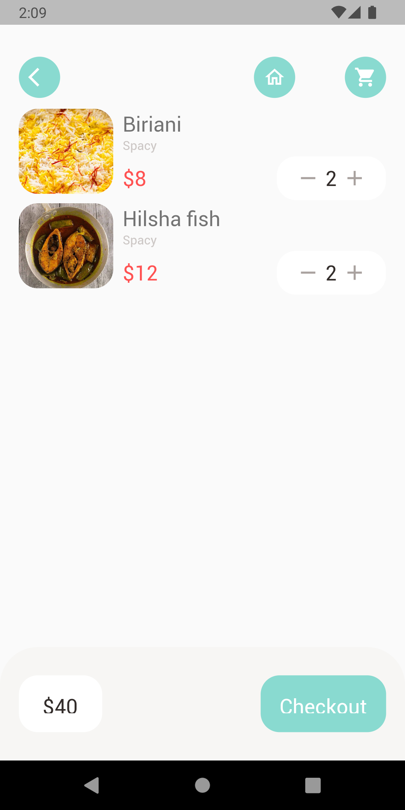

# Food Delivery App

Hello there!
This is a food delivery app developed in flutter.

This application is being developed according to the classes of:

https://www.youtube.com/playlist?list=PL3nPgdhXQtHfgtMpD_0EvJm-8LP3uNfc-
Flutter E-commerce App Tutorial | Shop App | Food Delivery - dbestech Youtube Chanel;

### Versions

- **Flutter**: 3.0.5
- **Dart**: 2.17.6

### Setup

Clone it in your machine:
```bash
git clone https://github.com/RodrigoNP3/Food-Delivery-App.git
```

Dependecies:

```bash
dependencies:
  cupertino_icons: ^1.0.2
  get: ^4.1.4
  dots_indicator: ^2.1.0
  shared_preferences: ^2.0.15
  intl: ^0.17.0
  google_maps_flutter: ^2.2.0
  geocoding: ^2.0.5
  geolocator: ^9.0.2
```

### Navigation

<table>
<thead>
<tr>
<th align="center">Sign In Page</th>
<th align="center">Sign Up Page</th>
<th align="center">Home Page</th>
<th align="center">Home Page</th>


</tr>
</thead>
<tbody>
<tr>
  
<td align="center">
  <a target="_blank" rel="" href="images/Sign _In_Page.png">
        

  </a></td>
  
<td align="center">
  <a target="_blank" rel="" href="images/Sign _Up_Page.png">
        

  </a></td>
  
  
<td align="center">
  <a target="_blank" rel="" href="images/Home_Page_1.png">
        

  </a></td>
  
  
<td align="center">
  <a target="_blank" rel="" href="images/Home_Page_2.png">
        

  </a></td>
  
  
  <table>
<thead>
<tr>

<th align="center">Popular Food Detail Page</th>
  <th align="center">Recommended Food Detail Page</th>
    <th align="center">Cart Page</th>
        <th align="center">Cart History Page</th>

</tr>
</thead>
<tbody>
<tr>
  

  
  <td align="center">
  <a target="_blank" rel="" href="images/Popular_Food_Detail_Page.png">
        

  </a></td>
    <td align="center">
  <a target="_blank" rel="" href="images/Recommended_Food_Detail_Page.png">
        

  </a></td>
  <td align="center">
  <a target="_blank" rel="" href="images/Cart_Page.png">
        

  </a></td>
    <td align="center">
  <a target="_blank" rel="" href="images/Cart_History_Page.png">
        

  </a></td>
  
<table>
<thead>
<tr>
<th align="center">Add Address Page</th>


</tr>
</thead>
<tbody>
<tr>
  
<td align="center">
  <a target="_blank" rel="" href="images/add_address_page.png">
        

  </a></td>


  
  

  
  
  
 
  
